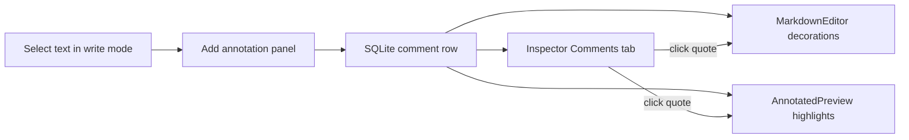

# Paragraph / Block Annotations

Annotations let authors attach revision notes, flags, or reminders to **specific manuscript ranges** in Draft, Revised, or Final. They extend the existing chapter **Comments** tab in the Inspector — same SQLite store and HTTP API, with optional range metadata for staged annotations.

**Important:** Annotations are **workflow metadata only**. They live in the database, never modify saved manuscript text, and are **not** included in Markdown, EPUB, or reader-facing exports.

---

## Annotation vs general note

| Kind | `stage` value | Range metadata | Created from |
|---|---|---|---|
| **Staged annotation** | `draft`, `revised`, or `final` | `quote`, `start_offset`, `end_offset`, `paragraph_hash` | Text selection in Manuscript Studio (write mode) |
| **General note** | `comment` (default) | Optional `quote` only | Inspector **Comments** tab manually |

Staged annotations are tied to the pipeline stage where they were created. General notes are chapter-level and not stage-specific.

---

## Author workflow

### Create from selection (Draft / Revised / Final)

1. Open a chapter and select **Draft**, **Revised**, or **Final**.
2. In **write** mode, select a passage in the editor.
3. Click the **✎ Annotate** toolbar button (visible when text is selected).
4. Enter your note and click **Add annotation**.
5. The Inspector opens on **Comments** with the new entry; the note stores the quoted passage, character offsets, and current stage.

### Create from Inspector

1. Open the Inspector → **Comments** tab.
2. Optionally paste a **Quote** and write the note body.
3. Click **Add note**. Stage defaults to the current pipeline stage (or `comment` for outline-only context).

### View and filter

- **Stage filter** chips: All, Draft, Revised, Final, General.
- Filter defaults to the currently selected pipeline stage when you switch stages.
- Each card shows a stage badge, optional offset range, quoted passage, body, resolve/reopen, and delete.

### Write and preview highlights

Unresolved staged annotations for the **current stage** are highlighted in amber in both write mode and preview mode. Click a quote in the Inspector to **focus** the matching highlight (stronger ring). Highlights are display-only — they do not appear in exported files.

---

## Data model

Annotations reuse the `comment` table. Extended fields:

| Field | Type | Purpose |
|---|---|---|
| `body` | string | Author note (required) |
| `quote` | string | Quoted passage text |
| `stage` | `draft` \| `revised` \| `final` \| `comment` | Pipeline stage or general note |
| `start_offset` | int \| null | Inclusive start index in stage text at creation time |
| `end_offset` | int \| null | Exclusive end index |
| `paragraph_hash` | string | SHA-256 (first 16 hex chars) of whitespace-normalized quote; auto-derived when omitted |
| `resolved` | bool | Hidden from preview highlights when true |
| `created_at` | ISO timestamp | Sort order in Inspector |

`paragraph_hash` is stored for future relocation when offsets drift. **It is not used for highlight placement today.**

---

## Highlight placement (preview)

`computeHighlightRanges` in `web/src/lib/annotations.ts` resolves each unresolved annotation for the active stage:

1. If `start_offset` / `end_offset` are in range and the slice still matches `quote` (whitespace-normalized), use those offsets.
2. If offsets no longer match the quote, find exact quote matches and prefer the one nearest the original `start_offset`.
3. If only `quote` is present (no valid offsets), search by quote alone.
4. Very short word-like quotes are ignored when they only match inside a larger word.
5. Overlapping ranges are merged for display.

### Known limitations

- **Offset drift** — editing after annotating can invalidate stored offsets; quote fallback prefers nearby exact matches but may still be ambiguous.
- **`paragraph_hash` stored for future relocation** — current highlighting still uses offsets and quote matching first.
- **Ambiguous quotes** — repeated long quotes can still resolve to the wrong nearby occurrence.
- **No agent integration** — annotations do not affect prompts, continuity checks, or StoryState.

---

## Export behavior

| Export | Annotations included? |
|---|---|
| Markdown manuscript | No |
| EPUB | No |
| Project package (`.novel-os.zip`) | Yes — serialized in DB `comments` array for backup/restore |

Manuscript files on disk are never modified by annotations.

---

## HTTP API

All routes are under `/api/projects/{project_id}/chapters/{number}/comments`.

| Method | Path | Purpose |
|---|---|---|
| `GET` | `.../comments` | List comments/annotations (newest first) |
| `POST` | `.../comments` | Create (`body` required) |
| `PATCH` | `.../comments/{cid}` | Update fields (`resolved`, `body`, `quote`, `stage`, offsets, hash) |
| `DELETE` | `.../comments/{cid}` | Delete |

**Validation:**

- `stage` must be one of `draft`, `revised`, `final`, `comment`
- `start_offset` ≥ 0; `end_offset` ≥ `start_offset` when both set
- `body` cannot be empty on create

**Backward compatibility:** Older clients that send only `body` and optional `quote` receive `stage=comment` and auto-derived `paragraph_hash` from the quote.

See [API.md](API.md) for request/response shapes.

---

## Source files

| File | Role |
|---|---|
| `api/db.py` | `Comment` model, `paragraph_anchor_hash`, CRUD |
| `api/models.py` | `Comment`, `AddComment`, `UpdateComment` Pydantic models |
| `api/routes.py` | Comment endpoints and validation |
| `web/src/lib/annotations.ts` | Stage helpers, highlight range computation |
| `web/src/components/ManuscriptEditor.tsx` | Selection UI, annotate panel, preview wiring |
| `web/src/components/AnnotatedPreview.tsx` | Preview highlights + MentionMarkdown segments |
| `web/src/components/Inspector.tsx` | Comments tab, filters, focus navigation |
| `web/src/routes/ChapterView.tsx` | Loads comments, `createAnnotation`, focus state |
| `web/src/test/annotations.test.ts` | Highlight range unit tests |

See [ARCHITECTURE.md](ARCHITECTURE.md), [WORKFLOWS.md](WORKFLOWS.md), and [EXPORTS.md](EXPORTS.md).
