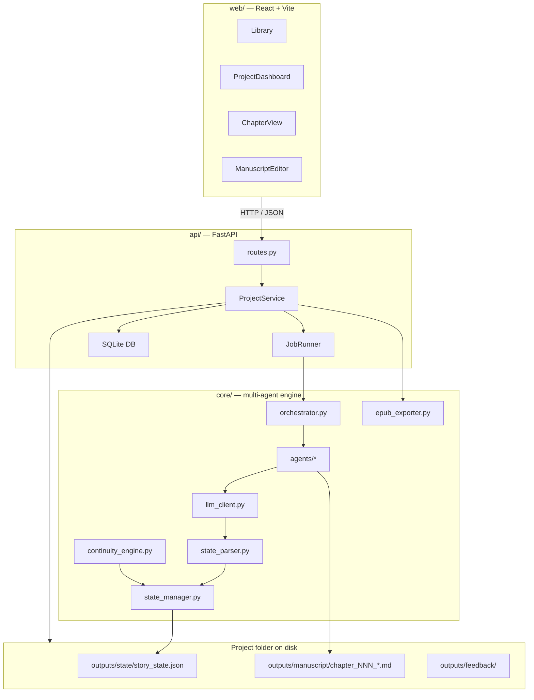
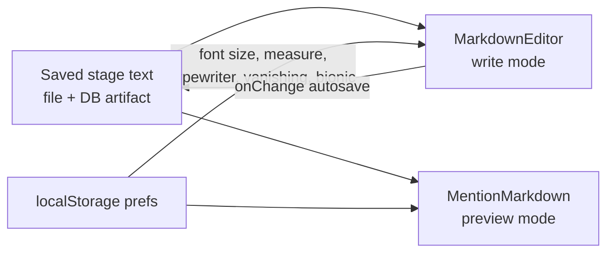
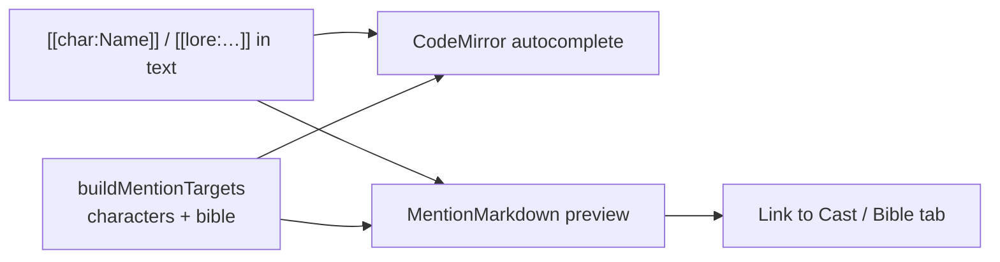
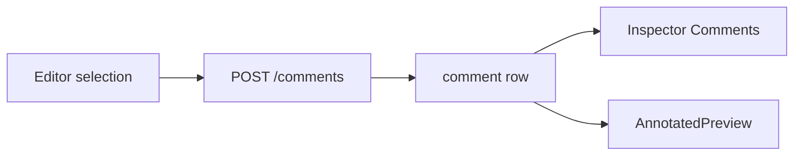
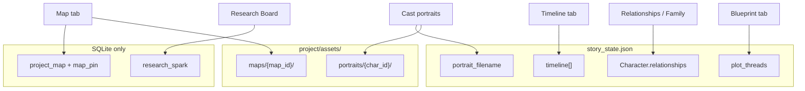
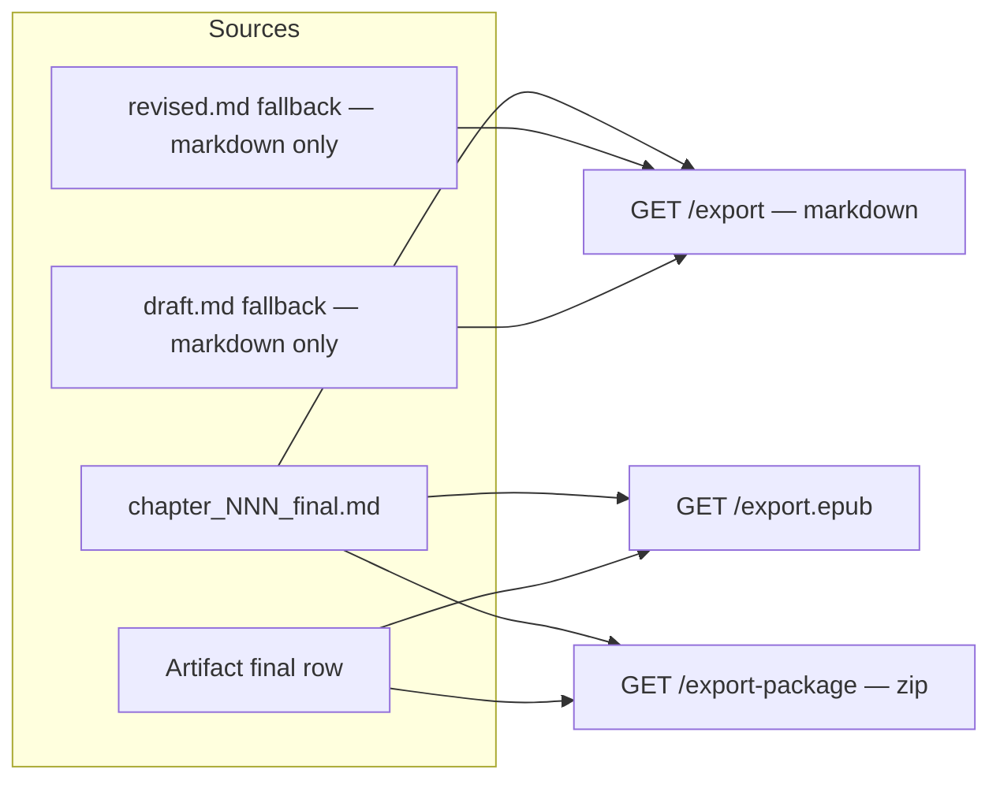
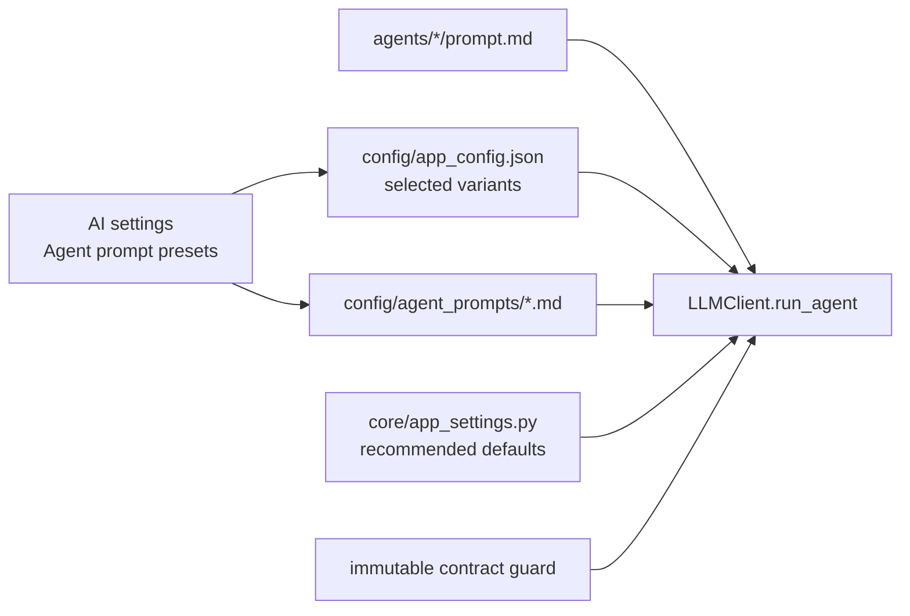

# Novel OS — System Architecture

Novel OS is a multi-agent fiction writing framework with a **file-based engine** (`core/`), a **FastAPI API** (`api/`), and a **React/Vite studio UI** (`web/`). Agents produce manuscript stages on disk; the API and UI layer add editing, versioning, and author-facing tools on top.

---

## Architecture overview



---

## Two stores, one bridge

Novel OS keeps **two stores** synchronized through ingest:

| Store | Location | Owns |
|---|---|---|
| **Filesystem** | `NOVEL_OS_PROJECTS_DIR/<project_id>/` | `story_state.json`, agent stage files (`outline`, `draft`, `revised`, `final`), feedback prompts |
| **SQLite** | `NOVEL_OS_DB` (default `sqlite:///./novel_os.db`) | `Project`, `Chapter`, `Artifact` (stage text), `Snapshot`, `Comment` |

**Bridge:** `db.ingest_project` mirrors engine-produced files into `Artifact` rows when chapters are read. **Final** is DB-first for human edits: `PUT /chapters/{n}/final` writes to both the file and the DB; ingest does not overwrite a saved Final from an older file.

### Why two stores?

The agent pipeline is mature and file-based. The database gives the UI fast queries, version history, comments, and a stable schema without rewriting the engine. Over time, more reads move DB-first while ingest keeps rows fresh.

---

## Chapter pipeline

Each chapter moves through agent phases and a human **Final** review step.


| Phase | Agent / actor | Artifact | Parsed to StoryState |
|---|---|---|---|
| Plan | Architect | `chapter_NNN_outline.md` | — |
| Draft | Scribe | `chapter_NNN_draft.md` | `[SCRIBE_STATE_UPDATE]` |
| Revise | Editor | `chapter_NNN_revised.md` | `[EDITOR_STATE_UPDATE]` |
| Validate | Continuity Guardian | `chapter_NNN_continuity_report.md` | `[CONTINUITY_STATE_UPDATE]` |
| Approve | Orchestrator | status → `complete` | — |
| Final | Author (UI) | `chapter_NNN_final.md` + DB artifact | — |
| Export | API / CLI | compiled `.md` or `.epub` | — |

**Quality gate:** Approve is blocked while the Guardian reports `Status: FAIL`.

**Pipeline step** (used by dashboard stats and status lights) is derived in `ProjectService._chapter_pipeline_step` from stage file presence and chapter status: `none` → `drafted` → `revised` → `validated` → `approved` → `final`. A chapter reaches `final` only when Final text exists on disk or in the DB.

---

## Manuscript Studio (display-only layer)

The studio editor (`ManuscriptEditor`) wraps CodeMirror for Draft, Revised, and Final stages. Reading aids (Focus, Typewriter, Vanishing, Bionic) are **presentation only** — they never change saved manuscript text.



See [MANUSCRIPT_STUDIO.md](MANUSCRIPT_STUDIO.md) for mode details.

---

## Mentions (author markup)

Authors can embed `[[char:…]]` and `[[lore:…]]` tokens in manuscript text. The UI resolves them against the Cast and Story Bible for autocomplete, preview links, and navigation. Resolved mentions also feed compact prompt context and continuity warnings; StoryState updates require author review. See [MENTIONS.md](MENTIONS.md).



---

## Annotations (DB-only workflow metadata)

Staged annotations extend the `comment` table with range metadata for Draft, Revised, and Final. Authors select text in write mode or add notes in the Inspector; write mode renders CodeMirror decorations and preview mode renders highlights via `AnnotatedPreview`. Data never flows into manuscript files or publishing exports.



See [ANNOTATIONS.md](ANNOTATIONS.md).

---

## Planning surfaces (features 10–16)

The project dashboard **Codex** tabs add visual planning tools on top of StoryState and SQLite. None of them alter manuscript artifacts or agent prompts unless noted.



| Feature | Storage | Mutable from UI | Agent / export impact |
|---|---|---|---|
| Timeline | StoryState | Yes (CRUD) | None |
| Relationship graph / genealogy | StoryState `relationships` | Yes (character editor) | None |
| Blueprint canvas | Read-only aggregate | No | None |
| Research sparks | SQLite | Yes (CRUD) | None |
| Map pins | SQLite + image assets | Yes | None |
| Portraits | StoryState + image assets | Upload/remove only | None |

See [TIMELINE.md](TIMELINE.md), [RELATIONSHIPS.md](RELATIONSHIPS.md), [BLUEPRINT.md](BLUEPRINT.md), [RESEARCH.md](RESEARCH.md), [MAPS.md](MAPS.md), [PORTRAITS.md](PORTRAITS.md).

---

## Export flow



EPUB includes **Final text only** and strips mention markup. Markdown export falls back through Final → Revised → Draft per chapter. See [EXPORTS.md](EXPORTS.md).

---

## Frontend preferences vs canonical data

| Data | Storage | Survives reload | Affects agents |
|---|---|---|---|
| Manuscript text (draft / revised / final) | Project files + SQLite `Artifact` | Yes | Yes (engine reads files) |
| Snapshots, comments / annotations | SQLite | Yes | No |
| Global system prefix | `config/global_system_prefix.md` | Yes | Yes, prepended to every agent |
| Agent prompt preset selection | `config/app_config.json` | Yes | Yes, selects current / recommended / custom per agent |
| Custom agent prompts | `config/agent_prompts/*.md` | Yes | Yes, with immutable output-contract guardrails |
| Editor size, measure, typewriter, vanishing, bionic | `localStorage` (`novelos-editor-*`) | Yes (per browser) | No |
| Focus mode (hide binder / pipeline) | React state (session) | No | No |
| Write vs preview mode | React state (session) | No | No |

Canonical manuscript content always lives in the project folder and/or DB artifacts. Studio toggles only change how text is displayed or scrolled.

## Story Memory Boundaries

| Surface | Canonical Role | Prompt Role |
|---|---|---|
| Story Bible | Durable canon: world rules, setting facts, themes, stable relationship facts | Included where prompt builders request bible context |
| Story Style / Tone | Authoritative writing style: tone, POV defaults, tense, prose style, vocabulary | Included where prompt builders request style context |
| Story Graph | Structural planning: arcs, subplots, dependencies, character-to-plot links | Selected through chapter briefs; full graph is not dumped everywhere |
| Chapter Brief / Landed Beats | Per-chapter prompt focus and events that landed in that chapter | Included when the saved brief is attached to chapter planning/drafting |
| Timeline | Chronological ordering of events | Manual reference today; not a substitute for bible rules or graph structure |

Landed beats do not automatically update Story Bible canon. If a landed beat establishes a reusable world fact, it should be promoted through a reviewed Story Bible / Lorekeeper flow.

---

## Agent prompt selection

`LLMClient.run_agent()` loads the current agent prompt file, then asks `app_settings.effective_agent_prompt()` which variant should be sent to the local model.



Variants:

- **current** — uses `agents/<agent>/prompt.md`.
- **recommended** — uses the built-in recommended prompt from `core/app_settings.py`.
- **custom** — uses `config/agent_prompts/<agent>.md`; parser-critical agents also receive an appended immutable output contract.

This preserves author control while protecting state parsing for blocks such as `[SCRIBE_STATE_UPDATE]`, `[REVISED_CHAPTER]`, and `[CONTINUITY_REPORT]`. See [PROMPTS.md](PROMPTS.md).

---

## Request lifecycle examples

- **View a chapter:** `GET /chapters/{n}/stages` → ingest mirrors files → returns outline / draft / revised / final.
- **Edit Final:** `PUT /chapters/{n}/final` → atomic file write + `db.upsert_artifact(final)`.
- **Run an agent:** `POST /run` → `JobRunner` thread → orchestrator; UI polls `GET /jobs/{id}` and refetches.
- **Export EPUB:** `GET /projects/{id}/export.epub` → `_get_final_text_for_export` per chapter → `build_epub`.

---

## Persistence schema (SQLite)

| Table | Key fields |
|---|---|
| `project` | id (slug), title, genre, author, status |
| `chapter` | project_id, number, title, status, pov, word_count |
| `artifact` | project_id, chapter, stage, text, word_count |
| `snapshot` | project_id, chapter, label, source, text, word_count, created_at |
| `comment` | project_id, chapter, body, quote, resolved, created_at, stage, start_offset, end_offset, paragraph_hash |
| `research_spark` | project_id, title, body, kind, tags, links, timestamps |
| `project_map` | project_id, name, image_filename, timestamps |
| `map_pin` | project_id, map_id, label, x, y, lore_section, lore_label, notes |

Portable project packages include DB exports for research, maps, and pins plus `assets/maps/` and `assets/portraits/`. See [EXPORTS.md](EXPORTS.md).

---

## Module map

```
core/          orchestrator, state_manager, llm_client, state_parser,
               continuity_engine, epub_exporter
agents/        architect, scribe, editor, continuity_guardian, style_curator
api/           FastAPI routes, ProjectService, JobRunner, db
web/           React routes, ManuscriptEditor, dashboard, API client
```

---

## Related docs

| Document | Contents |
|---|---|
| [WORKFLOWS.md](WORKFLOWS.md) | Author-facing step-by-step flows |
| [MANUSCRIPT_STUDIO.md](MANUSCRIPT_STUDIO.md) | Focus, Typewriter, Bionic, Vanishing |
| [MENTIONS.md](MENTIONS.md) | Character and lore mention syntax |
| [ANNOTATIONS.md](ANNOTATIONS.md) | Staged paragraph/block annotations |
| [DASHBOARD_STATS.md](DASHBOARD_STATS.md) | Progress metrics on the project dashboard |
| [EXPORTS.md](EXPORTS.md) | Markdown, EPUB, and project package export |
| [TIMELINE.md](TIMELINE.md) | Chronological story events (StoryState) |
| [RELATIONSHIPS.md](RELATIONSHIPS.md) | Relationship graph and genealogy |
| [BLUEPRINT.md](BLUEPRINT.md) | Read-only plot canvas |
| [RESEARCH.md](RESEARCH.md) | Pre-canon research sparks (SQLite) |
| [MAPS.md](MAPS.md) | Map images and location pins |
| [PORTRAITS.md](PORTRAITS.md) | Upload-only character portraits |
| [PROMPTS.md](PROMPTS.md) | Prompt presets and safe customization |
| [API.md](API.md) | HTTP and Python APIs |
