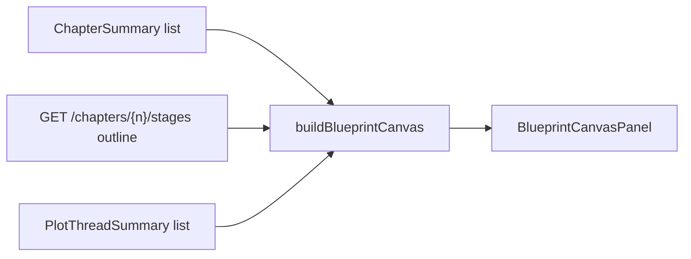

# Blueprint Plot Canvas

The **Blueprint** tab is a **read-only** planning board: chapter cards grouped into three act lanes, outline snippets, pipeline status, and plot-thread tags inferred from outline text. It mirrors existing StoryState and chapter artifacts — **no drag-and-drop, no canvas coordinates, no mutation**.

**Important:** Edit chapters, outlines, and plot threads in their respective tabs. The blueprint does not write back to StoryState.

---

## Author workflow

1. Open **Blueprint** tab.
2. Review **Act I / II / III** lanes (chapters split by count: ⌈n/3⌉, ⌈2n/3⌉−⌈n/3⌉, remainder).
3. Each card shows chapter number, title, pipeline dot, optional outline snippet, and matched plot-thread chips.
4. Toggle **Compact** / **Detailed** view (saved in `localStorage` under `novel-os:blueprint-view-mode`).
5. Click a plot-thread chip → **Plot Threads** tab with that thread selected.
6. Click a chapter card → chapter view for that number.

---

## Plot-thread matching

`web/src/lib/blueprintCanvas.ts` matches threads when the thread **name** or any **subplot** label appears in the chapter outline text or title:

- Case-insensitive substring match for labels ≥ 4 characters.
- Shorter labels require word boundaries.
- First matching label per thread wins; chips show which label matched.

This is a **display heuristic**, not proof the thread advances in that chapter.

---

## Functional boundaries

- **Read-only** — no PATCH/POST from the canvas.
- **Does not** store layout JSON on `PlotThread` or chapters.
- **Does not** affect agent prompts or continuity checks.
- Act boundaries are **mathematical thirds**, not author-defined act breaks.

---

## Known limitations

- Chapters without outlines show title and pipeline only.
- Thread detection misses synonyms not present in thread name/subplots.
- No export as image or PDF.
- No link from canvas cards to timeline events or map pins.

---

## Source files

| File | Role |
|---|---|
| `web/src/components/BlueprintCanvasPanel.tsx` | Act lanes and cards |
| `web/src/lib/blueprintCanvas.ts` | Grouping, snippet, thread matching |
| `web/src/test/blueprintCanvas.test.ts` | Unit tests for layout helpers |

See [WORKFLOWS.md](WORKFLOWS.md).
