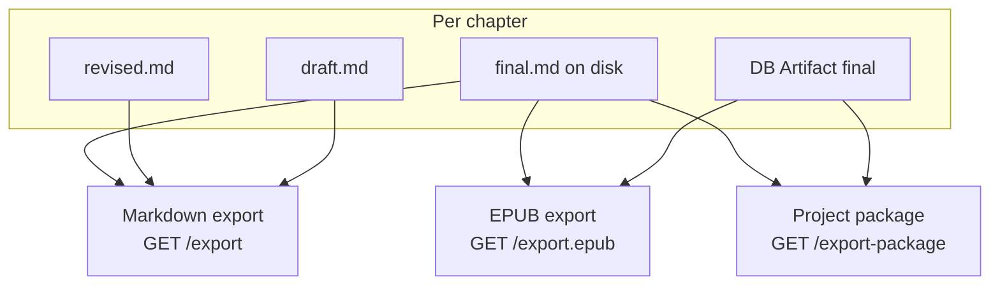

# Exports

Novel OS supports three export paths from the project dashboard and HTTP API: **Markdown manuscript**, **EPUB**, and **portable project package**.

---

## Export flow

---

## Markdown manuscript

| | |
|---|---|
| **UI** | Project dashboard → **Export manuscript** |
| **API** | `GET /api/projects/{project_id}/export` |
| **CLI** | `python core/orchestrator.py export --format markdown` |
| **Output** | Single `.md` file (`{project_id}.md` from UI) |

**Chapter selection:** Every chapter in StoryState, sorted by number.

**Text source per chapter** (first non-empty wins):

1. `outputs/manuscript/chapter_NNN_final.md`
2. `outputs/manuscript/chapter_NNN_revised.md`
3. `outputs/manuscript/chapter_NNN_draft.md`

Chapters with no text at any stage are omitted. A title header and genre line are prepended.

**Mentions:** Markup is **not** stripped — `[[char:…]]` and `[[lore:…]]` appear verbatim in the Markdown file.

**Annotations:** Chapter comments and staged annotations are **not** included. See [ANNOTATIONS.md](ANNOTATIONS.md).

---

## EPUB

| | |
|---|---|
| **UI** | Project dashboard → **Export EPUB** |
| **API** | `GET /api/projects/{project_id}/export.epub` |
| **Output** | `{project_id}.epub` (`application/epub+zip`) |

### Final-only behavior

EPUB includes **only chapters that have Final text**. There is no fallback to Revised or Draft.

Final text is read from:

1. `chapter_NNN_final.md` on disk, then
2. SQLite `Artifact` row for stage `final` (`_get_final_text_for_export`)

**Skipped chapters:** Chapters without Final are silently omitted from the spine.

**Empty project:** If no chapter has Final text, the API returns **400** with `"No chapters with Final text to export."`

### Mention stripping

Before XHTML conversion, `strip_mentions` replaces markup with plain labels:

- `[[char:Full Name]]` → `Full Name`
- `[[lore:section:Label]]` → `Label`
- `[[lore:Label]]` → `Label`

The same rules apply in `web/src/lib/mentions.ts` (`stripMentions`) for consistency.

### EPUB contents (implemented)

- EPUB 3 package (`mimetype`, `META-INF/container.xml`, `OEBPS/content.opf`)
- Navigation document (`nav.xhtml`) with chapter list
- One XHTML file per included chapter
- DC metadata: `title`, `creator` (author), `language` (en)

### Not implemented

- Cover image
- Custom front matter (dedication, copyright, blurb)
- Scene-level structure within chapters

Markdown subset in body: paragraphs, `#` / `##` headings, `---` horizontal rules.

**Annotations:** Not included in EPUB body or metadata.

---

## Project package

| | |
|---|---|
| **UI** | Project dashboard → **Export project** |
| **API** | `GET /api/projects/{project_id}/export-package` |
| **Output** | `{slugified-title}.novel-os.zip` |

Portable zip of the project folder (`outputs/`, `assets/maps/`, `assets/portraits/`) plus serialized DB data for artifacts, snapshots, comments, research sparks, maps, and pins. Import via `POST /api/projects/import-package`.

Use this for backup, migration, or sharing a full project — not for reader-facing distribution.

### What the package includes

| Data | In package? | Location |
|---|---|---|
| Manuscript stages, state JSON, feedback | Yes | `outputs/` tree in zip |
| Comments / annotations | Yes | `db_export.json` → `comments` |
| Timeline events, relationships, portrait filenames | Yes (metadata) | `outputs/state/story_state.json` |
| Research sparks | Yes | `db_export.json` → `research_sparks` |
| Map records and pins | Yes | `db_export.json` → `project_maps`, `map_pins` |
| Portrait image files | Yes | `assets/portraits/{character_id}/` in zip |
| Map image files | Yes | `assets/maps/{map_id}/` in zip |

Import restores `outputs/`, `assets/maps/`, and `assets/portraits/` using path-validated zip extraction (traversal paths are skipped). Map asset folders are renamed when map IDs are remapped on import. See [RESEARCH.md](RESEARCH.md), [MAPS.md](MAPS.md), [PORTRAITS.md](PORTRAITS.md).

---

## Comparison

| Export | Final required | Revised/Draft fallback | Mentions in output | Annotations in output | Reader format |
|---|---|---|---|---|---|
| Markdown | No | Yes | Verbatim markup | No | `.md` |
| EPUB | Yes (per chapter) | No | Stripped to labels | No | `.epub` |
| Project package | N/A (full project) | N/A | Preserved in source files | Yes (comments only in DB export) | `.novel-os.zip` |

---

## Source files

| File | Role |
|---|---|
| `api/services.py` | `export_markdown`, `export_epub`, `export_project_package` |
| `api/routes.py` | HTTP endpoints |
| `core/project_archive.py` | Shared archive file iteration and safe zip extraction |
| `core/project_portable.py` | Portable package build/import |
| `core/project_backup.py` | Named/quick backups (same archive layout) |
| `web/src/api/client.ts` | `exportUrl`, `exportEpubUrl`, `exportProjectPackageUrl` |

See [API.md](API.md) and [WORKFLOWS.md](WORKFLOWS.md).
