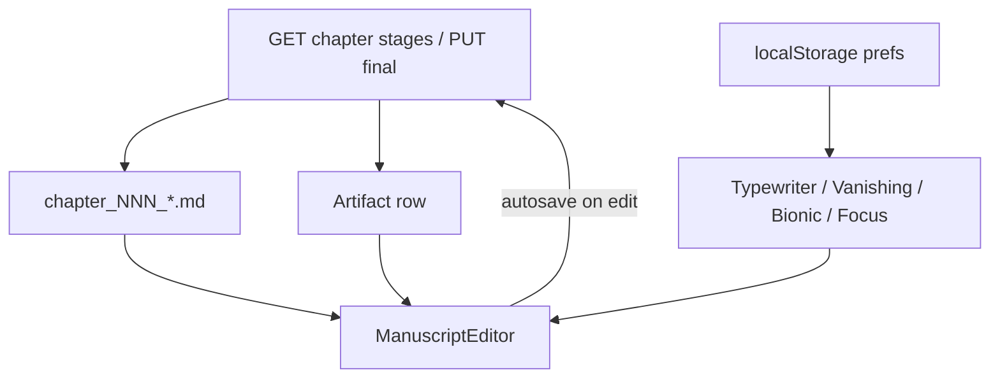

# Manuscript Studio

The **Manuscript Studio** is the shared writing surface in the chapter view for **Draft**, **Revised**, and **Final** stages. It is implemented by `ManuscriptEditor` and used from `ChapterView` and `FinalEditor`.

All studio reading aids are **display-only**. They change scrolling, opacity, or preview rendering in the browser. **None of them alter saved manuscript text** — what you save is always the raw Markdown in the stage file and DB artifact.

---

## Modes

### Focus mode

- **Toggle:** **Focus** in the control strip (or **Exit focus** when active).
- **Behavior:** Hides the chapter binder and pipeline chrome so the editor fills the view. The control strip becomes sticky at the top.
- **Persistence:** Session only (not saved to disk or `localStorage`).
- **Does not change saved text.**

### Typewriter scroll

- **Toggle:** **Typewriter** chip in the control strip.
- **Behavior:** While typing, keeps the cursor line near the vertical center of the viewport (45% from top). Uses `requestAnimationFrame` scrolling in write mode.
- **Persistence:** `localStorage` key `novelos-editor-typewriter`.
- **Does not change saved text.**

### Vanishing mode

- **Toggle:** **Vanishing** chip in the control strip.
- **Behavior:** Fades lines above the active cursor line (opacity decreases with distance). Implemented as CodeMirror line decorations only.
- **Persistence:** `localStorage` key `novelos-editor-vanishing`.
- **Does not change saved text.**

### Bionic reading

- **Toggle:** **Bionic** chip — visible only in **preview** mode.
- **Behavior:** Emphasizes the first ~45% of each word with stronger weight and color. Applied in `MentionMarkdown` during preview render.
- **Persistence:** `localStorage` key `novelos-editor-bionic`.
- **Does not change saved text.** Bionic is never applied to the CodeMirror document or exported files.

---

## Other studio controls

| Control | Effect | Alters saved text? |
|---|---|---|
| **Write / Preview** | CodeMirror editor vs rendered Markdown | No (preview is read-only) |
| **A− / A+** | Font size (`novelos-editor-size`) | No |
| **Measure** (narrow / normal / wide) | Column width (`novelos-editor-measure`) | No |
| Format toolbar (bold, heading, etc.) | Inserts Markdown into the document | **Yes** — these are real edits |

Word count in the strip is computed from the current editor buffer (whitespace-split), not from StoryState.

---

## Recommended usage by stage

| Stage | Suggested studio setup | Why |
|---|---|---|
| **Draft** | Focus + Typewriter; Vanishing optional | Reduce distraction while generating or pasting first prose |
| **Revised** | Preview with Bionic occasionally; Typewriter while editing | Check flow and readability after the Editor agent; Bionic helps spot weak openings without changing source |
| **Final** | Preview for proofread pass; normal measure | Human-reviewed canonical text — use preview and Bionic for a fresh read before export |

Focus mode is useful at any stage when you want a clean writing surface.

---

## Data flow

Saved text path: **API → file + DB**. Display prefs path: **localStorage → editor chrome only**.

---

## Source files

| File | Role |
|---|---|
| `web/src/components/ManuscriptEditor.tsx` | Composes controls, toolbar, write/preview |
| `web/src/components/ManuscriptControls.tsx` | Focus, toggles, prefs hooks |
| `web/src/components/MarkdownEditor.tsx` | CodeMirror + typewriter/vanishing extensions |
| `web/src/components/MentionMarkdown.tsx` | Preview render + optional bionic |
| `web/src/components/manuscriptExtensions.ts` | Typewriter scroll and vanishing line decorations |

See also [WORKFLOWS.md](WORKFLOWS.md) and [MENTIONS.md](MENTIONS.md).
