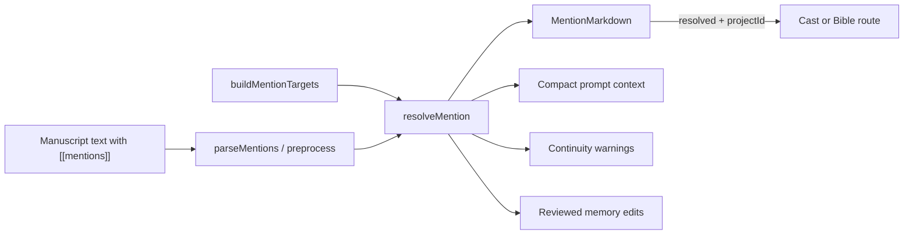

# Mentions

Mentions let authors link prose to **Cast** characters and **Story Bible** lore using inline markup. They improve navigation, preview, prompt context, continuity review, and author-approved memory updates.

**Important:** Mentions are **author intent signals**, not automatic story facts. Saving `[[char:Lena Vasquez]]` can give Scribe, Editor, and Guardian compact context and can surface warnings, but it does **not** update `StoryState` by itself. Character memory changes require explicit review and approval.

---

## Syntax

| Form | Example | Resolves against |
|---|---|---|
| Character | `[[char:Full Name]]` | Cast (`CharacterSummary.full_name`, aliases) |
| Lore (label) | `[[lore:Label]]` | Story bible entries by label |
| Lore (section + label) | `[[lore:section_key:Label]]` | Specific bible section (e.g. `world_rules`) |

Section keys match `BIBLE_SECTION_META` in `web/src/lib/mentions.ts` (`logline`, `themes`, `setting_summary`, `world_rules`, etc.). Writing tone is managed through Story Style / Tone, not lore mentions.

Plain labels are shown in preview and export when markup is stripped — see [EXPORTS.md](EXPORTS.md).

---

## Autocomplete

While editing in write mode, the CodeMirror extension offers completions when you type:

- `[[` — bracket form; filter with `char:`, `lore:`, or partial names
- `@` — inserts full mention markup plus a trailing space

Targets are built from the project's characters and story bible via `buildMentionTargets(characters, storyBible)`.

---

## Preview rendering

In **preview** mode, `MentionMarkdown`:

1. Preprocesses markup into internal `novel-mention:` links
2. Resolves each token against mention targets
3. Renders resolved mentions as styled links; unresolved ones as **broken** spans

| State | Appearance | Click behavior |
|---|---|---|
| Resolved character | `mention-char` link | Opens project dashboard **Cast** tab with character selected |
| Resolved lore | `mention-lore` link | Opens **Story Bible** tab, optionally scrolled to section |
| Broken (no match) | `mention-broken` span | No navigation; tooltip shows unresolved label |

Resolved character mentions also expose a small review action that opens the mention update review flow for that character.

---

## Resolution flow

Resolution is **case-insensitive** on labels. Character aliases count as matches. Lore with an explicit section requires both section and label to match a target.

---

## Broken mentions

A mention is **broken** when:

- **Character:** no cast member matches the label or aliases, or the match lacks an `id`
- **Lore:** no bible entry matches the label (and section, if specified)

Broken mentions still appear in saved text. Fix them by correcting the label, adding the character or bible entry, or using autocomplete to insert a valid token.

---

## Prompt context

When chapter text or mention-bearing planning text is sent through the AI workflow, Novel OS builds compact context cards for resolved mentions.

These cards may include:

- Character role, location, emotional state, selected knowledge, notes, and last appearance
- Lore section and brief matching story bible text
- Critical notes such as a character currently flagged dead/killed

The prompt block explicitly tells agents that mentions are **signals only**. They should treat mentions as author-marked relevance, not proof that an event happened on the page.

Current prompt consumers:

- Scribe / Draft
- Editor / Revise
- Guardian / Validate
- Architect only when planning from mention-bearing notes or text

---

## Continuity warnings

The deterministic continuity engine checks mention-bearing chapter text for non-blocking issues:

- `unresolved_mention`: a character or lore mention does not resolve against current Cast or Story Bible targets.
- `mention_dead_conflict`: a mentioned character appears in text while story memory flags them as dead/killed.

These findings warn the author and the Guardian, but they do not block saving or approval by themselves.

---

## Reviewed memory updates

The chapter screen includes a **Review mentions** panel, and resolved character mentions include an individual review action.

The panel can generate conservative suggestions from the chapter text and show them as editable before/after field changes. The author can modify proposed values, choose which edits to apply, and approve them explicitly.

Allowed character memory fields:

- `current_location`
- `emotional_state`
- `knowledge`
- `notes`
- `last_appearance_chapter`

`last_appearance_chapter` requires explicit presence approval. A bare mention, rumor, flashback, or hypothetical reference should not count as an on-page appearance.

Suggestions may be generated:

- On manual request from the review panel
- After validation
- After chapter mining workflows that request mention suggestions

---

## What mentions do not do

- Do not update `StoryState` without author approval
- Do not automatically register character appearances
- Do not prove location, relationship, timeline, or lore facts by themselves
- Do not participate in `[*_STATE_UPDATE]` parsing
- Do not change EPUB structure beyond label substitution when markup is stripped
- Do not overlap with staged **annotations** (DB-only revision notes on text ranges) — see [ANNOTATIONS.md](ANNOTATIONS.md)

---

## Source files

| File | Role |
|---|---|
| `web/src/lib/mentions.ts` | Syntax, parsing, resolution, autocomplete, strip for export |
| `web/src/components/MentionMarkdown.tsx` | Preview + navigation links |
| `web/src/components/MentionReviewPanel.tsx` | Reviewed memory update UI |
| `web/src/components/MarkdownEditor.tsx` | Autocomplete extension in write mode |
| `core/mentions.py` | Backend parsing and resolution |
| `core/mention_context.py` | Compact prompt context cards |
| `core/mention_updates.py` | Suggestions, review storage, approved apply |
| `core/continuity_engine.py` | Mention warning checks |
| `core/epub_exporter.py` | `strip_mentions` for EPUB body text |

See [MANUSCRIPT_STUDIO.md](MANUSCRIPT_STUDIO.md) and [ARCHITECTURE.md](ARCHITECTURE.md).
