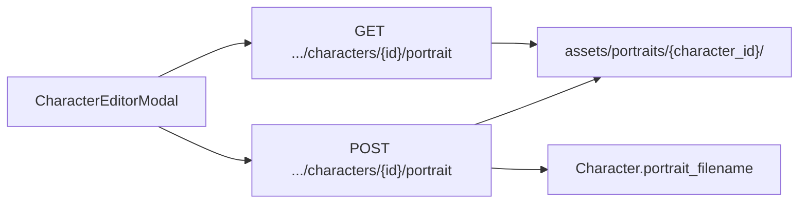

# Character Portraits

Feature **16** adds an optional **upload-only** portrait per cast member. Images display in the Cast list and character editor. `Character.portrait_filename` in StoryState points at files under `assets/portraits/{character_id}/`.

**Important:** There is **no AI image generation** provider in this pass — upload and remove only. Text property generation (LM Studio / Lorekeeper) remains separate and does not create portraits.

---

## Author workflow

1. Open **Cast** → select a character.
2. In the **Portrait** section, click **Upload portrait** and choose an image file.
3. Preview updates immediately; `portrait_filename` saves to StoryState on success.
4. Use **Replace portrait** or **Remove portrait** as needed.

Cast tab thumbnails use the same image URL with a cache-busting query when the portrait changes.

---

## API

| Method | Path | Purpose |
|---|---|---|
| `POST` | `/api/projects/{id}/characters/{character_id}/portrait` | Upload image (`multipart/form-data`, field `file`) |
| `DELETE` | `/api/projects/{id}/characters/{character_id}/portrait` | Remove portrait file and clear filename |
| `GET` | `/api/projects/{id}/characters/{character_id}/portrait` | Serve image bytes |

Character detail responses include `portrait_url` when a filename is set.

Frontend: `api.uploadCharacterPortrait`, `api.removeCharacterPortrait`, `characterPortraitUrl` in `web/src/api/client.ts`.

Allowed formats: PNG, JPEG, WebP, GIF (detected from file bytes). Paths are validated to prevent directory traversal.

---

## Functional boundaries

- **Upload only** — no DALL·E, SD, or LM Studio image endpoints.
- **Does not** affect continuity checks, mentions, or agent prompts.
- **Not** embedded in EPUB or Markdown export.
- Replacing a portrait deletes the previous file on disk.

---

## Backup and export considerations

- `portrait_filename` is stored in **`story_state.json`** → metadata survives portable package via `outputs/state/`.
- **Image bytes** live in **`assets/portraits/`** and are included in portable package and named backup zips.

See [EXPORTS.md](EXPORTS.md).

---

## Known limitations

- No cropping, focal point, or multiple angles per character.
- No automatic portrait from `physical_description`.
- Large images are stored as uploaded (no server-side resize in v1).
- Cast list loads portrait URLs per character — many large files may slow the dashboard.

---

## Source files

| File | Role |
|---|---|
| `web/src/components/CodexEditors.tsx` | Upload/remove UI in character modal |
| `web/src/routes/ProjectDashboard.tsx` | Cast thumbnails |
| `api/portrait_assets.py` | Safe image storage |
| `api/services.py` | Upload/remove/serve |
| `core/state_manager.py` | `Character.portrait_filename` |
| `tests/test_character_portraits_api.py` | API tests |

See [EXPORTS.md](EXPORTS.md) and [API.md](API.md).
