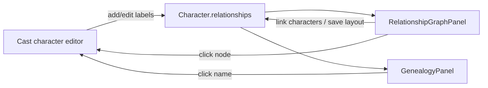

# Character Relationships & Genealogy

Features **10** (relationship graph) and **11** (family tree) visualize cast links from `Character.relationships` — a `Dict[character_id, label]` on each character in StoryState. Labels are edited in the **Cast** character editor; the relationship graph also supports layout and lightweight character linking. The family tree remains a derived navigation view.

**Important:** Relationship data is still stored in the existing string map keyed by character ID. Canonical role/subrole labels are encoded into that string, not a separate edge table. Family tree layout uses **heuristic label classification** (mother, child, spouse, etc.) — ambiguous or custom labels may not appear in the genealogy view.

## Design Intent

The relationship graph and family tree are author-facing views over cast relationships. They should minimize manual relationship bookkeeping by making mined or authored links visible, searchable, and easy to correct.

The relationship graph answers:

- Who is connected to whom?
- What is the current label from one character to another?
- Which relationships are family, authority, alliance, rivalry, romance, coercion, or custom?
- Which relationship facts should inform chapter planning and prompt context?

The family tree answers a narrower question: which stored relationships can be interpreted as genealogy or household/family structure. It is derived from relationship labels and should not become a separate source of truth.

## Product Principles

- **Single source of truth:** Store character relationships on `Character.relationships` until there is a deliberate schema migration.
- **Derived views:** Relationship graph, family tree, and future relationship timelines should derive from stored relationships rather than keep competing edge stores.
- **Review first:** Character mining may propose relationship changes, but applying those changes should remain explicit and reviewable.
- **Post-apply review:** Auto-accepted relationship updates should remain visible in the Review queue until marked reviewed or safely reverted.
- **Clear ambiguity:** Custom or ambiguous labels should remain visible on the relationship graph even if they cannot be safely placed in the family tree.
- **Low workload:** Users should be able to add or fix relationships from the graph, but should not need to rebuild relationship diagrams after every mining pass.
- **Prompt relevance:** Relationship data should become more useful when selecting chapter focus, explaining why characters matter to a plot node, or warning about contradictory relationship labels.

The relationship model is **canonical role + optional subrole**:

- The **canonical role** drives grouping, inverse mapping, family-tree traversal, graph logic, miner normalization, and AI prompt consistency.
- The **subrole** is what users see and what writing prompts should use.
- The subrole defaults to the canonical role label.
- Every alias/example under a canonical role is a valid subrole.
- Custom subroles remain supported as free text.

---

## Author workflow

### Edit relationships (source of truth)

1. Open **Cast** → click a character.
2. Scroll to **Relationships**.
3. Pick another cast member and enter a label (e.g. `mother`, `rival`, `mentor`).
4. Save (autosave). Remove links with the delete control per row.

### Relationship graph (Feature 10)

1. Open **Relationships** tab.
2. View an SVG graph: nodes = characters with at least one link; edges = directed arrows with labels.
3. Drag nodes to arrange the layout, link characters from the panel, and hover an edge to emphasize it.
4. Click a node to open that character in the Cast editor.

### Genealogy / family tree (Feature 11)

1. Open **Family** tab.
2. View a tree built from family-classified links: parent, child, sibling, spouse, guardian, adopted.
3. Spouse links show inline on each node; click names to open the character editor.
4. Characters without family-classified links may only appear if they are roots (no inferred parent).

### Intended future workflow

1. Mine or import chapters.
2. Review proposed character relationship changes.
3. Apply accepted changes to `Character.relationships`.
4. Use the relationship graph to inspect social structure and fix labels.
5. Use the family tree only for genealogy/household review.
6. Let chapter briefs and story graph context surface relationship relevance when drafting.

Relationship graph suggestions use the shared Review tab. Safe revert is conservative: if removing a relationship would conflict with newer edits or leave dependent graph/review state ambiguous, the app should block the revert and explain the manual cleanup needed.

---

## Role/subrole taxonomy

Relationship mining and UI suggestions should prefer these canonical roles. The labels in the alias/subrole column are examples of display subroles, not a closed list.

| Category | Canonical role pair | Alias/subrole examples | Usage |
|---|---|---|---|
| Family origin | `parent` / `child` | mother, father, son, daughter | Primary family-tree edges. |
| Family peer | `sibling` | brother, sister, twin | Peer family links. |
| Romantic | `lover` / `spouse` / `ex` | spouse, lover, ex-spouse, ex-lover | Use only when the relationship is established by context. |
| Social positive | `friend` / `ally` | best friend, teammate, accomplice | Broad positive/social alignment. |
| Social negative | `rival` / `enemy` | nemesis, adversary | Rival and enemy remain distinct. |
| Teaching | `teacher` / `student` | mentor, apprentice | Teacher/student is primary; mentor is a subrole. |
| Care/dependency | `caretaker` / `dependent` | guardian, ward | Care responsibility without implying family origin. |
| Work/authority | `employer` / `employee` | boss, manager, subordinate | Work hierarchy. |
| Household/service authority | `household master` / `servant` | master of house, domestic servant | Qualified household/service role. Use `household master` when plain `master` would be ambiguous. |
| Professional service | `provider` / `client` | doctor/patient, lawyer/client, therapist/patient | Professional care/service relationship. |
| Institutional command | `commander` / `subordinate` | officer/soldier, ruler/subject | Military, political, or institutional hierarchy. |
| Captivity/coercion | `captor` / `prisoner` | jailer, hostage, coercive master/servant, blackmailer/victim | Coercive power or confinement. |
| Consensual power dynamic | `dominant` / `submissive` | dom, sub | Separate from household service and captivity/coercion. |

Extended family relationships such as grandparent, cousin, aunt/uncle, and in-law should usually be **derived from family-tree traversal** through parent/child/spouse edges, not stored as predefined direct relationship labels.

Ambiguous labels should stay custom/free text unless context qualifies them. In particular, bare `partner` or `master` should not be auto-normalized without a qualifier.

---

## Label heuristics

`web/src/lib/characterRelationships.ts` classifies labels for the family tree:

| Family kind | Example tokens |
|---|---|
| `parent` | parent, mother, father, mom, dad |
| `child` | child, son, daughter |
| `sibling` | sibling, brother, sister, twin |
| `spouse` | spouse, husband, wife |
| `guardian` | guardian, ward |
| `adopted` | adopted, adoptive, foster |

Labels that do not match still appear on the **relationship graph** but are **omitted from genealogy layout** unless they indirectly connect family-classified nodes.

Directed edges on the graph reflect how each character stores the link (`fromId` → `toId`). Reciprocal relationships (A→B and B→A) show as two edges if both are authored.

---

## Functional boundaries

- **Lightweight editing** in the character modal and relationship graph; data still lands in `Character.relationships`.
- **Does not** feed Guardian continuity checks (e.g. estranged vs close) in this pass.
- Relationship mining may propose character relationship updates for review/apply.
- **Stored** in `story_state.json` → included in project package via `outputs/state/`.

---

## Known limitations

- Free-text labels can conflict (A lists B as `mother` while B lists A as `mother`).
- Genealogy assumes a single inferred parent per child when multiple parent links exist.
- Cycles in guardian/adoption heuristics are skipped to avoid infinite trees.
- No import/export dedicated to relationship diagrams (graph is not rendered to image/PDF).

---

## Source files

| File | Role |
|---|---|
| `web/src/components/RelationshipGraphPanel.tsx` | SVG relationship graph |
| `web/src/components/GenealogyPanel.tsx` | Family tree layout |
| `web/src/lib/characterRelationships.ts` | Edge building, label classification, tree layout |
| `web/src/components/CodexEditors.tsx` | Relationship editor in character modal |
| `core/state_manager.py` | `Character.relationships` field |

See [WORKFLOWS.md](WORKFLOWS.md).
