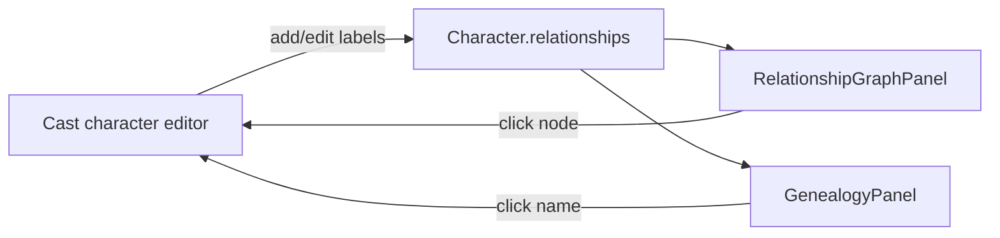

# Character Relationships & Genealogy

Features **10** (relationship graph) and **11** (family tree) visualize cast links from `Character.relationships` — a `Dict[character_id, label]` on each character in StoryState. Labels are edited in the **Cast** character editor; the graph and tree are read-mostly views with navigation back to the editor.

**Important:** Relationship data is **free-text labels keyed by character ID**. There is no separate edge table. Family tree layout uses **heuristic label classification** (mother, child, spouse, etc.) — ambiguous or custom labels may not appear in the genealogy view.

---

## Author workflow

### Edit relationships (source of truth)

1. Open **Cast** → click a character.
2. Scroll to **Relationships**.
3. Pick another cast member and enter a label (e.g. `mother`, `rival`, `mentor`).
4. Save (autosave). Remove links with the delete control per row.

### Relationship graph (Feature 10)

1. Open **Relationships** tab.
2. View a circular SVG graph: nodes = characters with at least one link; edges = directed arrows with labels.
3. Hover an edge to emphasize it; click a node to open that character in the Cast editor.

### Genealogy / family tree (Feature 11)

1. Open **Family** tab.
2. View a tree built from family-classified links: parent, child, sibling, spouse, guardian, adopted.
3. Spouse links show inline on each node; click names to open the character editor.
4. Characters without family-classified links may only appear if they are roots (no inferred parent).

---

## Label heuristics

`web/src/lib/characterRelationships.ts` classifies labels for the family tree:

| Family kind | Example tokens |
|---|---|
| `parent` | parent, mother, father, mom, dad |
| `child` | child, son, daughter |
| `sibling` | sibling, brother, sister, twin |
| `spouse` | spouse, husband, wife, partner, fiancé |
| `guardian` | guardian, ward |
| `adopted` | adopted, adoptive, foster |

Labels that do not match still appear on the **relationship graph** but are **omitted from genealogy layout** unless they indirectly connect family-classified nodes.

Directed edges on the graph reflect how each character stores the link (`fromId` → `toId`). Reciprocal relationships (A→B and B→A) show as two edges if both are authored.

---

## Functional boundaries

- **Lightweight editing** in the character modal only — no drag-to-connect on the graph.
- **Does not** feed Guardian continuity checks (e.g. estranged vs close) in this pass.
- **Does not** auto-create edges from mention intelligence or mining.
- **Stored** in `story_state.json` → included in project package via `outputs/state/`.

---

## Known limitations

- Free-text labels can conflict (A lists B as `mother` while B lists A as `mother`).
- Genealogy assumes a single inferred parent per child when multiple parent links exist.
- Cycles in guardian/adoption heuristics are skipped to avoid infinite trees.
- No import/export dedicated to relationship diagrams (graph is not rendered to image/PDF).

---

## Source files

| File | Role |
|---|---|
| `web/src/components/RelationshipGraphPanel.tsx` | SVG relationship graph |
| `web/src/components/GenealogyPanel.tsx` | Family tree layout |
| `web/src/lib/characterRelationships.ts` | Edge building, label classification, tree layout |
| `web/src/components/CodexEditors.tsx` | Relationship editor in character modal |
| `core/state_manager.py` | `Character.relationships` field |

See [WORKFLOWS.md](WORKFLOWS.md).
