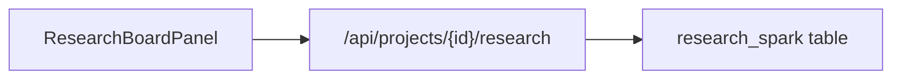

# Spark Research Board

The **Research Board** tab captures **pre-canon research sparks** — notes, links, quotes, image references, and ideas — in SQLite, separate from the Story Bible and manuscript. Use it for mood boards, source material, and planning scraps that should not pollute canonical lore.

**Important:** Research sparks **do not** update StoryState, agent prompts, or mention intelligence automatically. Optional links to characters, chapters, plot threads, or bible sections are **metadata for author navigation only**.

---

## Author workflow

1. Open **Research Board** tab.
2. Click **Add spark**.
3. Set title, body, kind (`note` \| `link` \| `quote` \| `image` \| `idea`), optional source URL, tags, attachment reference (free text), and optional links.
4. Filter the grid by search text, tag chip, or kind.
5. Edit or delete sparks from each card.

---

## Data model (SQLite)

Table `research_spark` in `api/db.py`:

| Field | Type | Notes |
|---|---|---|
| `id` | string | UUID |
| `title` | string | Required |
| `body` | string | Main content |
| `source_url` | string | External link |
| `tags` | JSON list | Filter chips |
| `kind` | string | `note`, `link`, `quote`, `image`, `idea` |
| `attachment_ref` | string | Path or caption — not file upload |
| `link_character_id` | string \| null | Must exist in cast |
| `link_chapter` | int \| null | Must exist in project |
| `link_plot_thread_id` | string \| null | Must exist in plot threads |
| `link_bible_section` | string \| null | Section key hint only |
| `created_at` / `updated_at` | ISO timestamps | |

---

## API

| Method | Path | Purpose |
|---|---|---|
| `GET` | `/api/projects/{id}/research` | List; query `q`, `tag`, `kind` |
| `POST` | `/api/projects/{id}/research` | Create |
| `PATCH` | `/api/projects/{id}/research/{spark_id}` | Update |
| `DELETE` | `/api/projects/{id}/research/{spark_id}` | Delete |

Frontend helpers: `api.researchSparks`, `api.createResearchSpark`, etc. in `web/src/api/client.ts`.

---

## Functional boundaries

- **Pre-canon** — distinct from Story Bible `import_notes` and manuscript text.
- **No prompt injection** — sparks are not sent to Scribe, Editor, Guardian, or Architect unless you copy text manually.
- **No StoryState mutation** on create/update/delete.
- **Not** included in Markdown or EPUB export.

---

## Backup and export considerations

Portable project package (`GET /export-package`) and named backups serialize research sparks in `db_export.json` → `research_sparks`. See [EXPORTS.md](EXPORTS.md).

---

## Known limitations

- `attachment_ref` is text only — no binary upload on the research board.
- No URL fetch or automatic page import.
- Tags and search are client-side filters over the full list (no server pagination).
- Linking to bible sections does not scroll Story Bible to an anchor automatically.

---

## Source files

| File | Role |
|---|---|
| `web/src/components/ResearchBoardPanel.tsx` | Grid, filters, modal |
| `web/src/lib/researchSparks.ts` | Tag/filter helpers |
| `api/db.py` | SQLite CRUD |
| `api/services.py` | Validation against StoryState links |

See [EXPORTS.md](EXPORTS.md) and [API.md](API.md).
