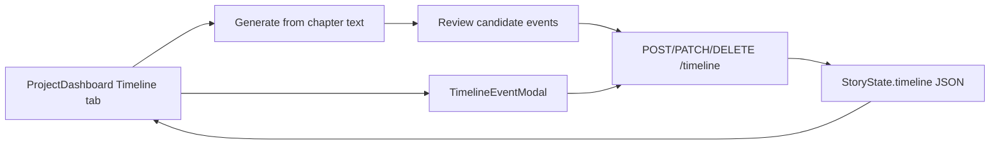

# Timeline View

The **Timeline** project tab is a chronological view of story events across chapters — scenes, flashbacks, backstory beats, and summaries. Events live in `StoryState.timeline` (`story_state.json`) and can be added manually or generated from chapter manuscript text for review.

**Important:** Timeline events are **planning and continuity metadata**. They do not alter manuscript text, agent prompts, or export output unless you later promote explicit integration. Generation is review-first: Novel OS scans chapter text, shows candidate events, and only saves the events you select.

---

## Author workflow

1. Open a project → **Timeline** tab.
2. Click **Generate from chapters** to scan final/revised/draft text and review candidate events, or click **Add event** to enter one manually.
3. In the generation modal, choose text source (`best`, `final`, `revised`, `draft`) and max events per chapter.
4. Select the generated candidates you want to keep and apply them.
5. Use list filters: chapter, character, event type, significance.
6. Edit or delete events from each card.

---

## Data model

Each `TimelineEvent` in `core/state_manager.py`:

| Field | Type | Notes |
|---|---|---|
| `id` | string | Auto-generated (`event_001`, …) |
| `description` | string | Required |
| `chapter` | int | Required; must reference an existing chapter |
| `day` | int \| null | Optional in-story day index |
| `time` | string \| null | Free text (e.g. `dawn`, `3pm`) |
| `location` | string | Free text |
| `characters_present` | list[string] | Character IDs |
| `event_type` | string | `scene` \| `backstory` \| `flashback` \| `summary` |
| `significance` | string | `minor` \| `major` \| `turning_point` \| `climax` |

Sorted in the UI by `(chapter, day, id)`.

---

## API

| Method | Path | Purpose |
|---|---|---|
| `GET` | `/api/projects/{id}/timeline` | List events |
| `POST` | `/api/projects/{id}/timeline` | Create event |
| `POST` | `/api/projects/{id}/timeline/generate` | Preview generated events from chapter text |
| `POST` | `/api/projects/{id}/timeline/generated-events` | Save selected generated events |
| `PATCH` | `/api/projects/{id}/timeline/{event_id}` | Update event |
| `DELETE` | `/api/projects/{id}/timeline/{event_id}` | Delete event |

Frontend helpers: `api.timelineEvents`, `api.generateTimeline`, `api.applyGeneratedTimelineEvents`, `api.createTimelineEvent`, `api.updateTimelineEvent`, `api.deleteTimelineEvent` in `web/src/api/client.ts`.

---

## Functional boundaries

- **Review-first generation** — chapter text scans produce candidates only; applying selected candidates creates saved events.
- **No hidden overwrite** — generation does not delete or replace existing timeline events.
- **Does not** inject timeline cards into Scribe, Editor, or Guardian prompts.
- **Does not** block chapter approval or continuity gates.
- **Included** in `story_state.json` → portable project package exports `outputs/state/story_state.json` (event metadata survives backup).

---

## Known limitations

- Existing projects may have an empty timeline until you add or generate events.
- `day` / `time` are author-defined; there is no calendar engine enforcing order across chapters.
- Duplicate or overlapping events are allowed; generated candidates are not automatically deduplicated against existing timeline cards.
- Linking events to plot threads or map pins is not implemented.

---

## Source files

| File | Role |
|---|---|
| `web/src/components/TimelinePanel.tsx` | List, filters, delete |
| `web/src/components/TimelinePanel.tsx` (`TimelineEventModal`) | Add/edit form |
| `web/src/components/TimelinePanel.tsx` (`TimelineGenerateModal`) | Generate/review/apply workflow |
| `core/timeline_extractor.py` | Deterministic chapter-text event extraction |
| `api/services.py` | CRUD, validation, generation preview/apply |
| `core/state_manager.py` | `TimelineEvent` dataclass and persistence |

See [WORKFLOWS.md](WORKFLOWS.md) and [API.md](API.md).
